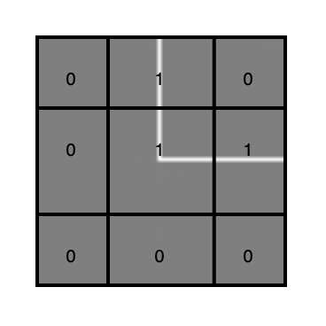

# WaveFunctionCollapseGenerator
The goal of the algorithm is to produce a coherent distribution of patterns over a grid of size
𝑛 × 𝑚, where the resulting values can be used as a basis for rendering 2D or 3D scenes. The generation process is semi-random: while preserving a degree of randomness, the choices are guided by compatibility constraints between adjacent elements.
 

 
The program takes two arguments as input from the terminal:
- the number of rows: ROW
- the number of columns: COL
 

After receiving these two arguments, it begins by reading a dictionary, which contains a collection of definitions for the puzzle pieces to be used in the generation process. Each piece is represented by a 3x3 matrix composed of binary values (0 or 1), which describe its structure and properties.
Before proceeding, it's important to note that a custom class named Cell was developed specifically for this project.
This class is used to construct the grid.
After reading the dictionary, the next step involves initializing each cell in the grid. During this initialization, the following parameters are passed to the Cell constructor:
- the position of the cell within the grid
- the initial value (set to -1)
- a boolean flag indicating whether the cell has been collapsed
- the reference dictionary containing all valid patterns

