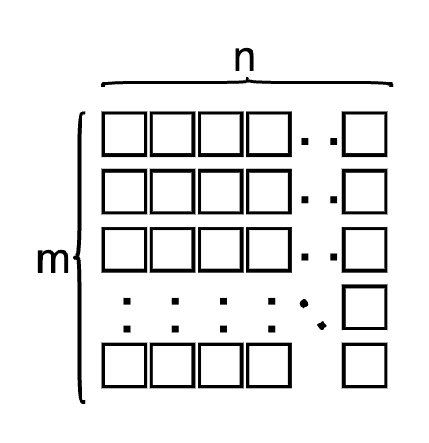
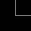
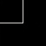
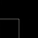
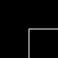
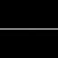
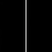
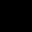
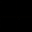
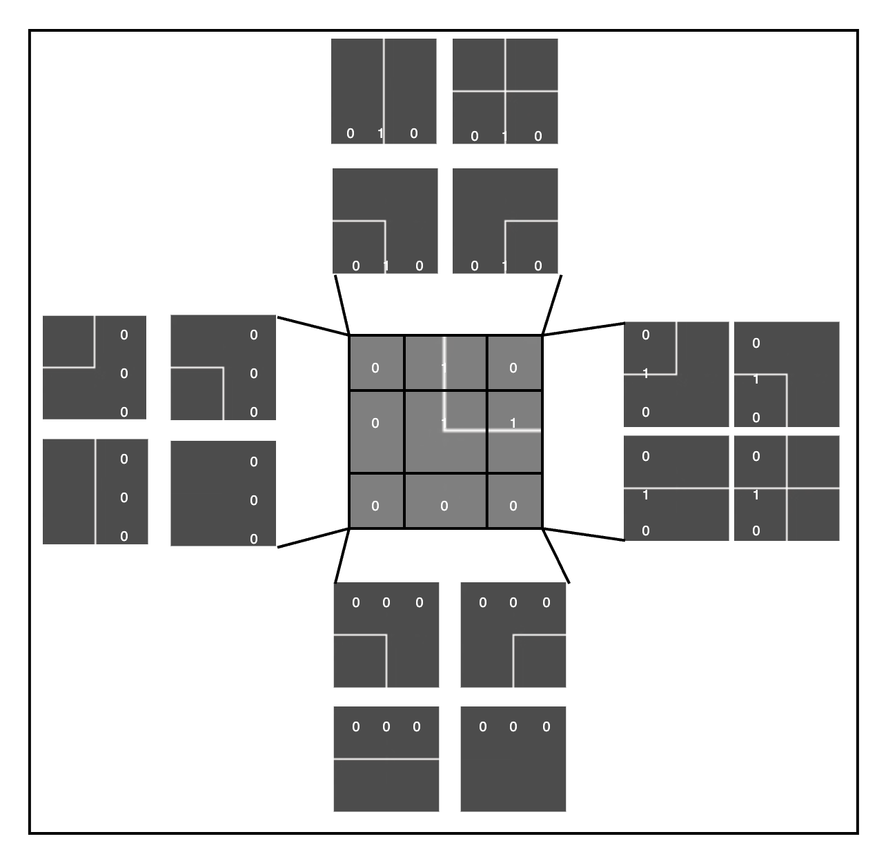

# WaveFunctionCollapseGenerator

The goal of the algorithm is to produce a coherent distribution of patterns over a grid of size  
**n × m**, where the resulting values can be used as a basis for rendering 2D or 3D scenes.  
The generation process is semi-random: while preserving a degree of randomness, the choices are guided by compatibility constraints between adjacent elements.

  

---

Let's say we have these pieces:

  
  
  

  
  
  

  
  

Each of them is numbered from 1 to 8 and we imagine that each image is made up of a 3×3 matrix,  
where the white lines are indicated by `1` and the black areas by `0`.
 

  

As with a puzzle, you have to find the pieces that fit together.

Example
 

The center tile has the possibility of having those neighbors.
---

### 🧾 Input

The program takes two arguments as input from the terminal:

- the number of rows: `ROW`
- the number of columns: `COL`

After receiving these two arguments, it begins by reading a dictionary, which contains a collection of definitions for the puzzle pieces to be used in the generation process. Each piece is represented by a **3×3** matrix composed of binary values (`0` or `1`), which describe its structure and properties.

Before proceeding, it's important to note that a custom class named `Cell` was developed specifically for this project.  
This class is used to construct the grid.

During the initialization phase, the following parameters are passed to the `Cell` constructor:

- the position of the cell within the grid
- the initial value (set to `-1`)
- a boolean flag indicating whether the cell has been collapsed
- the reference dictionary containing all valid patterns

---

### 🔄 Collapse and Propagation

After the initialization phase, a random cell is selected from the grid.  
A random value is then assigned to this cell, chosen from the set of available options defined in the dictionary (in this case, values range from `0` to `7`).

At this point, the cell is considered **collapsed** to a specific value, and its corresponding boolean flag is set to `true`.  
This state change is then **propagated to all adjacent cells**, updating their possible options accordingly based on compatibility constraints.
