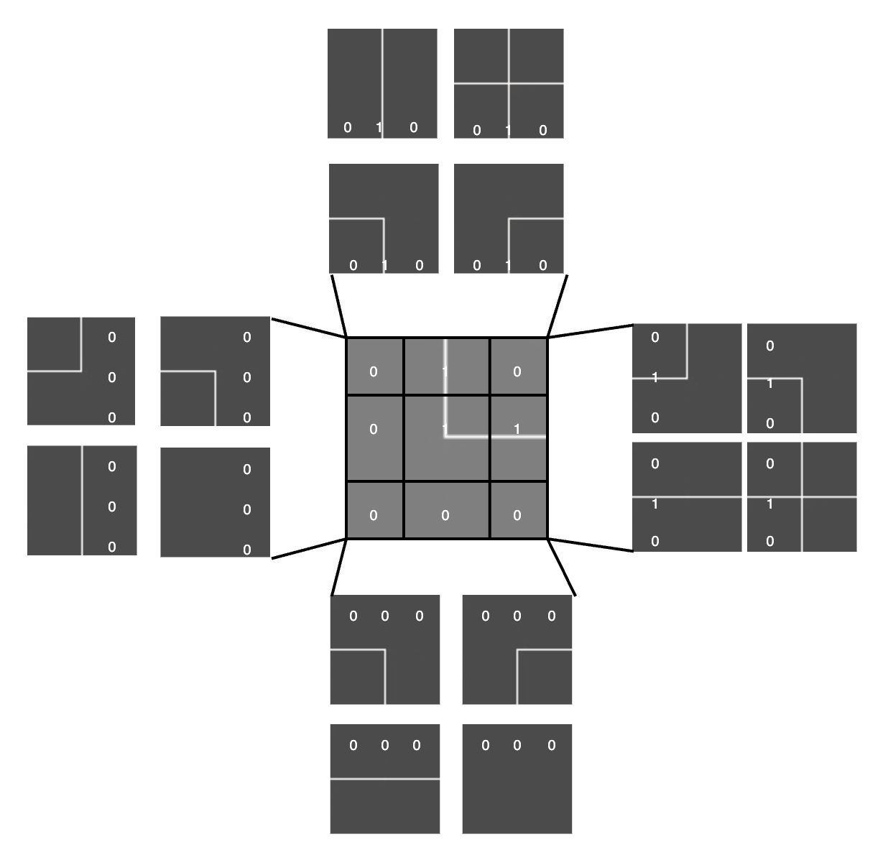

# WaveFunctionCollapseGenerator
The goal of the algorithm is to produce a coherent distribution of patterns over a grid of size
𝑛 × 𝑚, where the resulting values can be used as a basis for rendering 2D or 3D scenes. The generation process is semi-random: while preserving a degree of randomness, the choices are guided by compatibility constraints between adjacent elements.

 
The program begins by reading a dictionary, which contains a collection of definitions for the puzzle pieces to be used in the generation process. Each piece is represented by a 3x3 matrix composed of binary values ​​(0 or 1), which describe its structure and properties.

