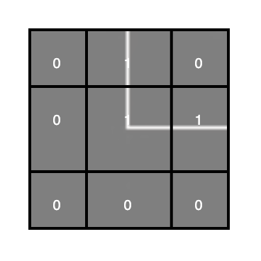
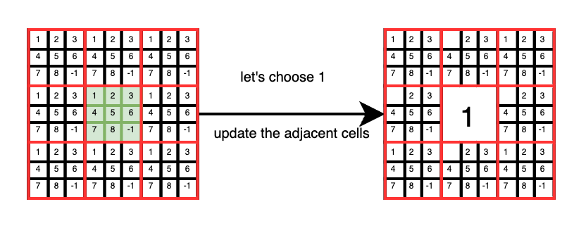
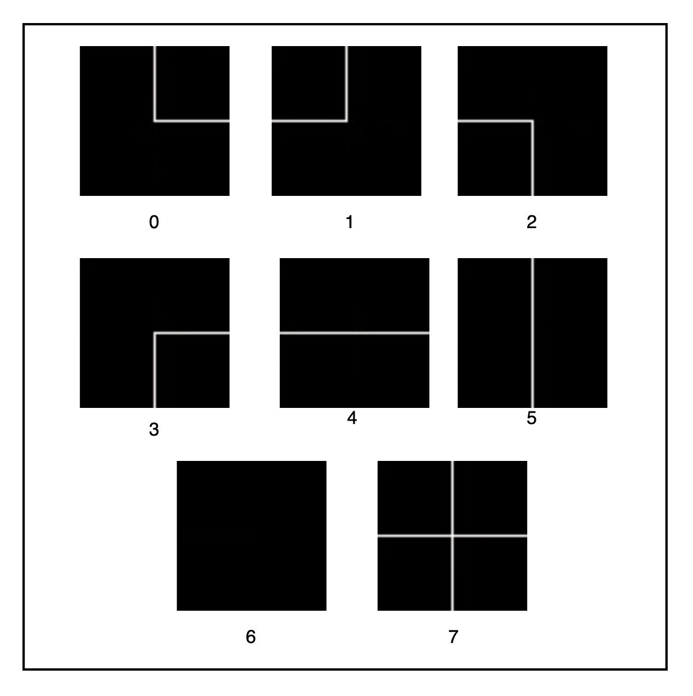

# WaveFunctionCollapseGenerator

The goal of the algorithm is to produce a coherent distribution of patterns over a grid of size  
**n × m**, where the resulting values can be used as a basis for rendering 2D or 3D scenes.  
The generation process is semi-random: while preserving a degree of randomness, the choices are guided by compatibility constraints between adjacent elements.

<p align="center">
  
</p>

---

Let's say we have these pieces:

<p align="center">
  
  
  
</p>

<p align="center">
  
  
  
</p>

<p align="center">
  
  
</p>

Each of them is numbered from 1 to 8 and we imagine that each image is made up of a 3×3 matrix,  
where the white lines are indicated by `1` and the black areas by `0`.
 

<p align="center">
  
</p>
As with a puzzle, you have to find the pieces that fit together.

Example
<br>
<p align="center">
    
</p>
The center tile has the possibility of having those neighbors.

---

### 🧾 How it works

The program takes two arguments as input from the terminal:

- the number of rows: `ROW`
- the number of columns: `COL`

After receiving these two arguments, it begins by reading a dictionary, which contains a collection of definitions for the puzzle pieces to be used in the generation process. Each piece is represented by a **3×3** matrix composed of binary values (`0` or `1`), which describe its structure and properties.

Before proceeding, it's important to note that a custom class named `Cell` was developed specifically for this project.  
This class is used to construct the grid.

During the initialization phase, the following parameters are passed to the `Cell` constructor:

- the position of the cell within the grid
- the initial value (set to `-1`)
- a boolean flag indicating whether the cell has been collapsed
- the reference dictionary containing all valid patterns

---

### 🔄 Collapse and Propagation

After the initialization phase, a random cell is selected from the grid.  
A random value is then assigned to this cell, chosen from the set of available options defined in the dictionary (in this case, values range from `0` to `7`).

At this point, the cell is considered **collapsed** to a specific value, and its corresponding boolean flag is set to `true`.  
This state change is then **propagated to all adjacent cells**, updating their possible options accordingly based on compatibility constraints.

---

It's like a Sudoku that starts with all the cells empty.
<p align="center">
    
</p>

Adjacent cells are reduced to those compatible options after the value 1 is assigned to the middle cell.

---

### 💻 How to run the code
Make sure you're inside the `src` directory:

```bash
cd src
javac Main.java Cell.java
row=10
col=10
java -cp . Main Cell $row $col #run the code
```
The output will be a file named output.txt, containing an n × m grid filled with values that represent the combination of tiles.

We associate a value from 0 to 7 to each image.
<p align="center">
    
</p>

---

### 📄 Example Output 

A possible output is the following, written to the output.txt file:

3  1  0  4  7  4  7  2  6  6  
0  2  3  2  5  6  5  5  6  6  
4  1  0  7  7  2  0  1  3  2  
3  4  2  0  7  1  6  6  0  1  
7  4  7  4  1  3  2  3  4  2  
7  2  5  6  6  0  7  7  4  7  
1  5  0  4  4  4  1  5  3  7  
2  0  4  4  2  6  6  0  7  1  
0  2  3  2  0  2  3  2  0  2  
4  1  0  1  6  0  1  0  2  5